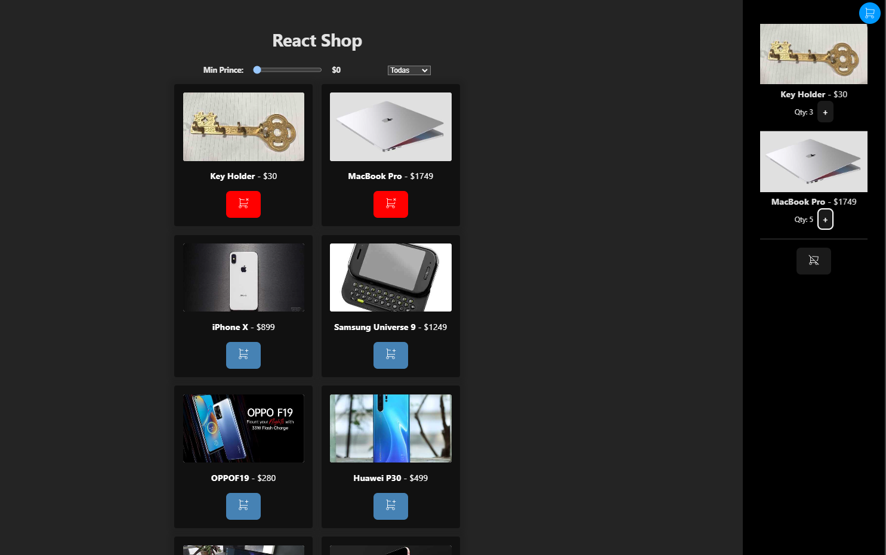

1. Ecommerce

- Muestra una lista de productos que vienen de un JSON - DONE
- Añade un filtro por categoría - DONE
- Añade un filtro por precio - DONE
- Haz uso de useContext para evitar pasar props innecesarias. - DONE

2. Carrito:

- Haz que se puedan añadir los productos a un carrito. - DONE
- Haz que se puedan eliminar los productos del carrito. - DONE
- Haz que se puedan modificar la cantidad de productos del carrito. - DONE
- Sincroniza los cambios del carrito con la lista de productos. - DONE
- Guarda en un localStorage el carrito para que se recupere al recargar la página. - DONE

